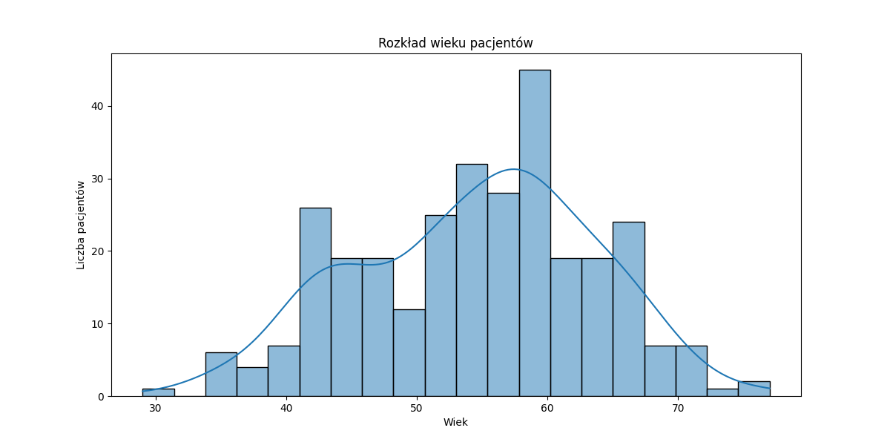
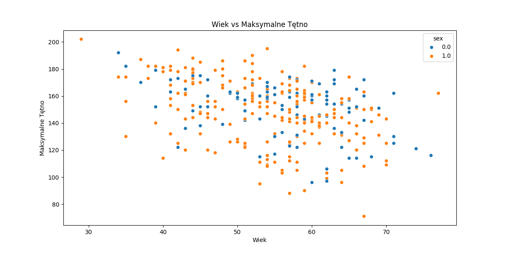
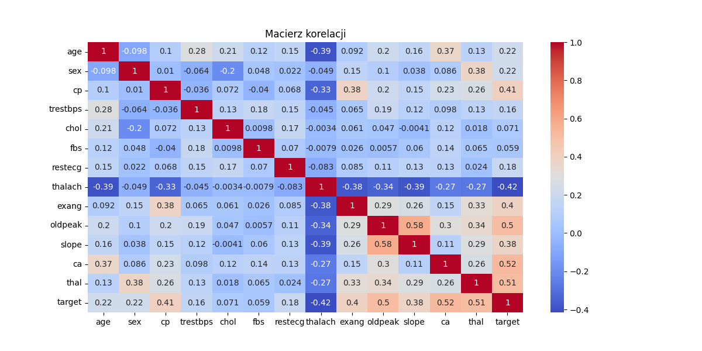

Eksploracja Danych
==================

# Statystyki opisowe

|       |       age |        sex |         cp |   trestbps |     chol |        fbs |    restecg |   thalach |      exang |   oldpeak |      slope |         ca |      thal |     target |
|:------|----------:|-----------:|-----------:|-----------:|---------:|-----------:|-----------:|----------:|-----------:|----------:|-----------:|-----------:|----------:|-----------:|
| count | 303       | 303        | 303        |   303      | 303      | 303        | 303        |   303     | 303        | 303       | 303        | 303        | 303       | 303        |
| mean  |  54.4389  |   0.679868 |   3.15842  |   131.69   | 246.693  |   0.148515 |   0.990099 |   149.607 |   0.326733 |   1.0396  |   1.60066  |   0.663366 |   4.72277 |   0.937294 |
| std   |   9.03866 |   0.467299 |   0.960126 |    17.5997 |  51.7769 |   0.356198 |   0.994971 |    22.875 |   0.469794 |   1.16108 |   0.616226 |   0.934375 |   1.93838 |   1.22854  |
| min   |  29       |   0        |   1        |    94      | 126      |   0        |   0        |    71     |   0        |   0       |   1        |   0        |   3       |   0        |
| 25%   |  48       |   0        |   3        |   120      | 211      |   0        |   0        |   133.5   |   0        |   0       |   1        |   0        |   3       |   0        |
| 50%   |  56       |   1        |   3        |   130      | 241      |   0        |   1        |   153     |   0        |   0.8     |   2        |   0        |   3       |   0        |
| 75%   |  61       |   1        |   4        |   140      | 275      |   0        |   2        |   166     |   1        |   1.6     |   2        |   1        |   7       |   2        |
| max   |  77       |   1        |   4        |   200      | 564      |   1        |   2        |   202     |   1        |   6.2     |   3        |   3        |   7       |   4        |
## Rozkład wieku pacjentów

## Wykres pudełkowy poziomu cholesterolu

## Wiek vs Maksymalne Tętno

## Poziom Cholesterolu vs Ciśnienie Krwi

## Macierz korelacji

