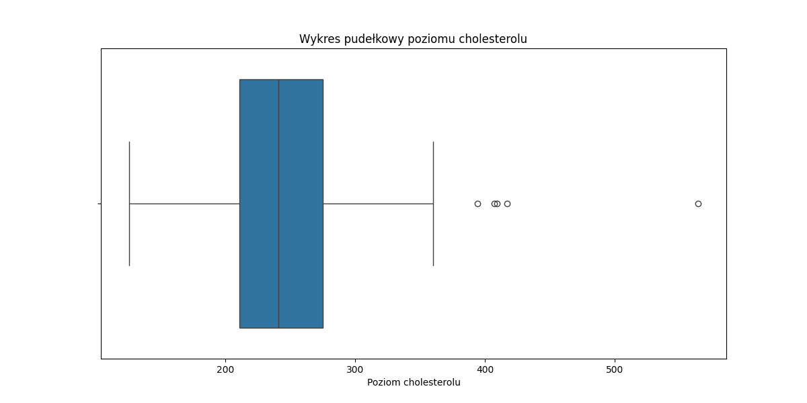
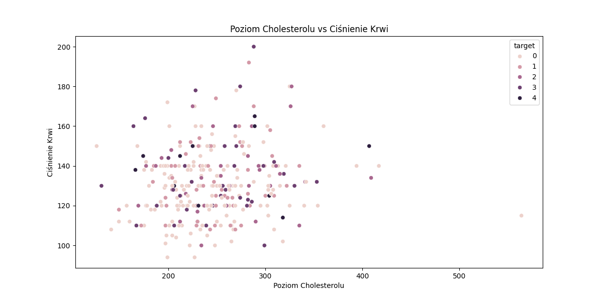
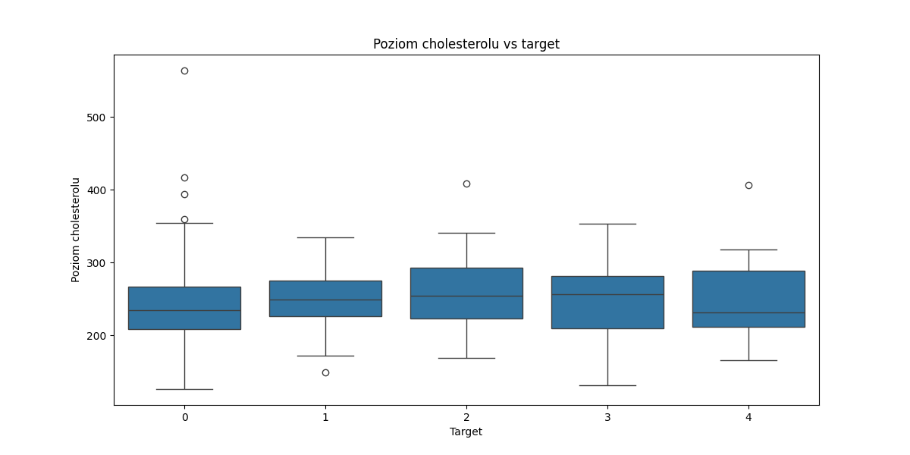

Eksploracja Danych
==================

# Statystyki opisowe

|       |       age |        sex |         cp |   trestbps |     chol |        fbs |    restecg |   thalach |      exang |   oldpeak |      slope |         ca |      thal |     target |
|:------|----------:|-----------:|-----------:|-----------:|---------:|-----------:|-----------:|----------:|-----------:|----------:|-----------:|-----------:|----------:|-----------:|
| count | 303       | 303        | 303        |   303      | 303      | 303        | 303        |   303     | 303        | 303       | 303        | 303        | 303       | 303        |
| mean  |  54.4389  |   0.679868 |   3.15842  |   131.69   | 246.693  |   0.148515 |   0.990099 |   149.607 |   0.326733 |   1.0396  |   1.60066  |   0.663366 |   4.72277 |   0.937294 |
| std   |   9.03866 |   0.467299 |   0.960126 |    17.5997 |  51.7769 |   0.356198 |   0.994971 |    22.875 |   0.469794 |   1.16108 |   0.616226 |   0.934375 |   1.93838 |   1.22854  |
| min   |  29       |   0        |   1        |    94      | 126      |   0        |   0        |    71     |   0        |   0       |   1        |   0        |   3       |   0        |
| 25%   |  48       |   0        |   3        |   120      | 211      |   0        |   0        |   133.5   |   0        |   0       |   1        |   0        |   3       |   0        |
| 50%   |  56       |   1        |   3        |   130      | 241      |   0        |   1        |   153     |   0        |   0.8     |   2        |   0        |   3       |   0        |
| 75%   |  61       |   1        |   4        |   140      | 275      |   0        |   2        |   166     |   1        |   1.6     |   2        |   1        |   7       |   2        |
| max   |  77       |   1        |   4        |   200      | 564      |   1        |   2        |   202     |   1        |   6.2     |   3        |   3        |   7       |   4        |
## Rozkład wieku pacjentów

## Wykres pudełkowy poziomu cholesterolu

## Wiek vs Maksymalne Tętno

## Poziom Cholesterolu vs Ciśnienie Krwi

## Macierz korelacji

## Rozkład ciśnienia krwi

## Rozkład depresji ST

## Poziom cholesterolu vs target

## Wiek vs Poziom Cholesterolu

## Macierz kontyngencji dla sex i target

|   sex |   0 |   1 |   2 |   3 |   4 |
|------:|----:|----:|----:|----:|----:|
|     0 |  72 |   9 |   7 |   7 |   2 |
|     1 |  92 |  46 |  29 |  28 |  11 |
## Macierz kontyngencji dla cp i target

|   cp |   0 |   1 |   2 |   3 |   4 |
|-----:|----:|----:|----:|----:|----:|
|    1 |  16 |   5 |   1 |   0 |   1 |
|    2 |  41 |   6 |   1 |   2 |   0 |
|    3 |  68 |   9 |   4 |   4 |   1 |
|    4 |  39 |  35 |  30 |  29 |  11 |
## Macierz kontyngencji dla fbs i target

|   fbs |   0 |   1 |   2 |   3 |   4 |
|------:|----:|----:|----:|----:|----:|
|     0 | 141 |  51 |  27 |  27 |  12 |
|     1 |  23 |   4 |   9 |   8 |   1 |
## Macierz kontyngencji dla restecg i target

|   restecg |   0 |   1 |   2 |   3 |   4 |
|----------:|----:|----:|----:|----:|----:|
|         0 |  95 |  23 |  19 |  12 |   2 |
|         1 |   1 |   0 |   1 |   1 |   1 |
|         2 |  68 |  32 |  16 |  22 |  10 |
## Macierz kontyngencji dla exang i target

|   exang |   0 |   1 |   2 |   3 |   4 |
|--------:|----:|----:|----:|----:|----:|
|       0 | 141 |  30 |  14 |  12 |   7 |
|       1 |  23 |  25 |  22 |  23 |   6 |
## Macierz kontyngencji dla slope i target

|   slope |   0 |   1 |   2 |   3 |   4 |
|--------:|----:|----:|----:|----:|----:|
|       1 | 106 |  22 |   7 |   6 |   1 |
|       2 |  49 |  31 |  26 |  24 |  10 |
|       3 |   9 |   2 |   3 |   5 |   2 |
## Macierz kontyngencji dla ca i target

|   ca |   0 |   1 |   2 |   3 |   4 |
|-----:|----:|----:|----:|----:|----:|
|    0 | 133 |  27 |   9 |   8 |   3 |
|    1 |  21 |  19 |  14 |   8 |   3 |
|    2 |   7 |   6 |   9 |  14 |   2 |
|    3 |   3 |   3 |   4 |   5 |   5 |
## Macierz kontyngencji dla thal i target

|   thal |   0 |   1 |   2 |   3 |   4 |
|-------:|----:|----:|----:|----:|----:|
|      3 | 130 |  22 |   8 |   6 |   2 |
|      6 |   6 |   3 |   6 |   1 |   2 |
|      7 |  28 |  30 |  22 |  28 |   9 |
## Analiza Outlierów

